# Informações do Projeto 

## PCFÁCIL

Engenharia de Software - 1 Período (Manhã)

## Participantes

-  Guilherme Leroy Teixeira Capanema
-  Henry Sven Ribeiro da Costa
-  Ian Matsuhara Ferraz
-  Julia Gabriela de Resende
-  Kayler de Freitas Moura
-  Otávio Augusto Dutra Costa
-  Yan Esquerdo Norte

# Estrutura do Documento

- [Informações do Projeto](#informações-do-projeto)
  - [Participantes](#participantes)
- [Estrutura do Documento](#estrutura-do-documento)
- [Introdução](#introdução)
  - [Problema](#problema)
  - [Objetivos](#objetivos)
  - [Justificativa](#justificativa)
  - [Público-Alvo](#público-alvo)
- [Especificações do Projeto](#especificações-do-projeto)
  - [Personas e Mapas de Empatia](#personas-e-mapas-de-empatia)
  - [Histórias de Usuários](#histórias-de-usuários)
  - [Requisitos](#requisitos)
    - [Requisitos Funcionais](#requisitos-funcionais)
    - [Requisitos não Funcionais](#requisitos-não-funcionais)
  - [Restrições](#restrições)
- [Projeto de Interface](#projeto-de-interface)
  - [User Flow](#user-flow)
  - [Wireframes](#wireframes)
- [Metodologia](#metodologia)
  - [Divisão de Papéis](#divisão-de-papéis)
  - [Ferramentas](#ferramentas)
  - [Controle de Versão](#controle-de-versão)
- [Referências](#referências)

# Introdução

  Comprar peças para computador pode ser uma tarefa desafiadora para muitas pessoas. A variedade de componentes disponíveis no mercado, combinada com a rápida evolução da tecnologia, pode tornar difícil a decisão de qual peça comprar. Além disso, muitos consumidores não têm conhecimento técnico suficiente para identificar as especificações corretas de cada componente e como combiná-los para formar um sistema completo, funcional e que atenda a necessidade deles.
 
  Outra dificuldade é encontrar preços adequados nas pesquisas. Com tantas opções disponíveis em diversas lojas físicas e online, pode ser desafiador comparar os preços e encontrar a melhor oferta. Além disso, a compatibilidade entre os componentes também pode ser uma preocupação. Cada peça deve ser compatível com as outras, para garantir o funcionamento do sistema como um todo.
 
  Neste contexto, um website de auxílio para montagem de computadores pode ser muito útil para fornecer informações e orientações sobre como construir um computador do zero, quais são os componentes necessários, e trazer da forma mais clara possível informações da peça ideal. Além disso, pode fornecer dicas de resolução de problemas, bem como fornecer suporte técnico para os usuários que encontrarem problemas durante o processo de montagem.

## Problema

Conforme o exposto, o problema que se busca resolver com este projeto é a falta de informação e objetividade na busca de informação para montagem ou compra de um computador que têm criado problemas  para indivíduos que buscam se informar sobre um computador ideal para uso, com confiabilidade e agilidade, trazendo prejuízos financeiros ou uma compra ruim em muitos casos.

## Objetivos

O objetivo geral do website é fornecer informações e orientações completas e confiáveis sobre o computador ideal a qual o usuário deseja. O site será projetado para ajudar pessoas com diferentes níveis de conhecimento e habilidades, desde iniciantes até usuários experientes, a construir um computador personalizado que atenda às suas necessidades específicas. O site fornecerá uma ampla gama de recursos, incluindo guias passo a passo, listas de componentes recomendados e dicas de solução de problemas para ajudar os usuários a criar ou comprar um computador funcional e de alta qualidade. O objetivo é auxiliar os usuários a montar seu próprio computador com confiança e sucesso, economizando dinheiro e obtendo uma compreensão mais profunda da tecnologia por trás do hardware de computador.

## Justificativa

Muitas pessoas têm interesse em construir um computador personalizado mas podem não ter conhecimento técnico suficiente para fazê-lo sozinhas. Além disso, muitos usuários podem se sentir confusos com a grande variedade de componentes disponíveis no mercado, e podem precisar de orientação sobre quais peças escolher para atender às suas necessidades específicas.

Um website de auxílio na montagem de computadores pode preencher essa lacuna, fornecendo informações confiáveis e orientações passo a passo sobre como montar um computador.

Além disso, a montagem de um computador personalizado pode oferecer uma série de benefícios em relação à compra de um computador montado e pronto, pode-se incluir a capacidade de escolher componentes de alta qualidade, personalizar o desempenho do sistema e economizar dinheiro. Dessa forma, pode ajudar a promover  benefícios, incentivando os usuários a explorar essa opção mais a fundo de forma prazerosa e objetiva.

## Público-Alvo

Acredita-se que todas as pessoas com tais dificuldades possa se beneficiar do projeto, mas  como foco principal indivíduos jovens ou de meia idade, independente de sexo, que tenham real interesse ou necessidade em montar um computador pessoal ou de uso profissional.

# Especificações do Projeto

A definição exata do problema e os pontos mais relevantes a serem tratados neste projeto foi consolidada com a participação dos usuários em um trabalho de imersão feito pelos membros da equipe a partir da observação dos usuários em seu local natural e por meio de entrevistas. Os detalhes levantados nesse processo foram consolidados na forma de personas e histórias de usuários.

## Personas e Mapas de Empatia

As personas levantadas durante o processo de entendimento do problema são apresentadas na Figuras que se seguem.

> 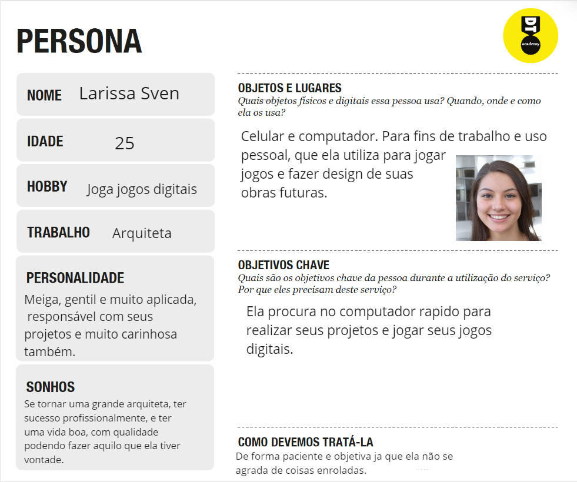
> 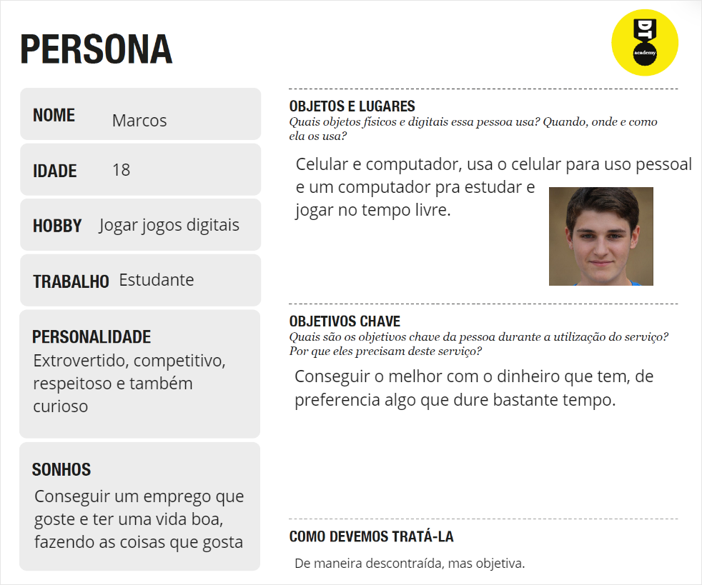
> 
> 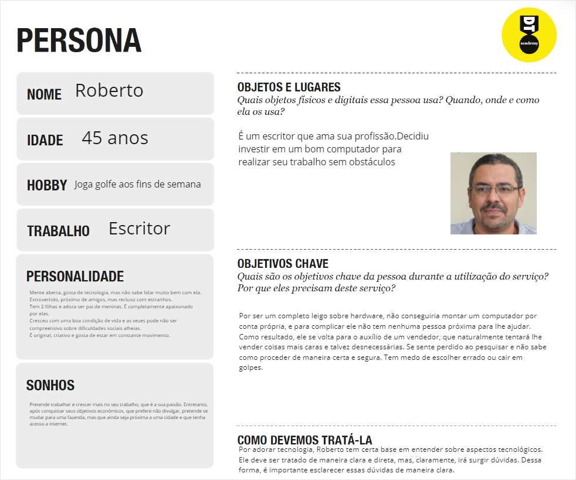

## Histórias de Usuários

Com base na análise das personas forma identificadas as seguintes histórias de usuários:

|EU COMO... `PERSONA`| QUERO/PRECISO ... `FUNCIONALIDADE` |PARA ... `MOTIVO/VALOR`                 |
|--------------------|------------------------------------|----------------------------------------|
|Larissa Sven        |Um computador que se adeque ao meu trabalho                     |Minha profissão, arquiteta,depende disso|
|Larissa Sven        |Um dispositivo que comporte meus jogos                          |Esse é meu passatempo nos momentos livres|
|Fátima              |Um dispositivo para ajudar minhas netas nas tarefas escolares   |Quero participar ativamente da educação delas|
|Fátima              |Um dispositivo que eu posso me entreter, mas também me comunicar|Gosto de passar meu tempo livre vendo vídeos sobre doces e meus filhos sempre dizem que preciso ser mais comunicativa|
|Marcos              |Uma máquina que possa ser útil para meus jogos                  |Me divirto jogando quando não estou ocupado com a faculdade|
|Marcos              |Um computador que possa me ajudar nas atividades da faculdade   |Curso Ciências da Computação, logo preciso de algo que suporte minhas atividades|
|Roberto             |Um dispositivo que comporte o meu trabalho                      |Meu trabalho de escritor faz com que eu precise lidar com arquivos relativamente pesados|
|Roberto             |Uma máquina capaz de trabalhar rapidamente em qualquer ocasião  |Gosto de estar sempre precavido, logo quero algo que seja capaz de realizar qualquer atividade que eu designe a ela|

## Requisitos

As tabelas que se seguem apresentam os requisitos funcionais e não funcionais que detalham o escopo do projeto.

### Requisitos Funcionais

A tabela a seguir apresenta os requisitos do projeto, identificando a prioridade em
que os mesmos devem ser entregues.

|ID    | Descrição do Requisito  | Prioridade |
|------|-----------------------------------------|----|
|RF-01| O site deve apresentar na página principal um carrossel de imagens do produto. | MÉDIA | 
|RF-02|O site deve apresentar uma navbar com caminhos para outras partes do site.| ALTA |
|RF-03|O site deve permitir ao usuário visualizar a descrição do produto com clareza.| ALTA | 
|RF-04|Os produtos devem conter imagens que correspondam ao que está sendo procurado.| ALTA | 
|RF-05|O site deve ser funcional, permitindo ao usuário pesquisar e encontrar o produto desejado.| ALTA | 
|RF-06|O site deve permitir ao usuário salvar as informações que lhe agradam.| MÉDIA | 
|RF-07|O site deve permitir ao usuário comentar em cada produto.| BAIXA | 
|RF-08|O site deve contar com um menu lateral para encontrar produtos.| ALTA | 
|RF-09|O site deve apresentar informações de contato dos desenvolvedores do site.| BAIXA |
|RF-10|O site deve apresentar a opção de filtrar o item de procura.| ALTA | 
|RF-11|O site deve apresentar ferramentas que facilitam para pessoas deficientes.| MÉDIA | 

### Requisitos não Funcionais

A tabela a seguir apresenta os requisitos não funcionais que o projeto deverá atender.

|ID     | Descrição do Requisito  |Prioridade |
|-------|-------------------------|----|
|RNF-01|O site vai ser publicado em ambiente acessível.| ALTA | 
|RNF-02|O site deverá ser responsivo em outros dispositivos.|  ALTA |
|RNF-03|O site deve ter boa estrutura de elementos|  MÉDIA |
|RNF-04|O site deve ser compatível em diversos browsers|  ALTA |

## Restrições

O projeto está restrito pelos itens apresentados na tabela a seguir.

|ID| Restrição                                             |Prioridade  |
|------|-------------------------------------------------------|----------|
|RE-01|O projeto deverá ser entregue no final do semestre letivo, não podendo extrapolar a data de 07/07/2023.|  ALTA |
|RE-02|O aplicativo deve se restringir às tecnologias básicas da Web no Frontend.|  ALTA |
|RE-03|A equipe não pode subcontratar o desenvolvimento do trabalho.|  ALTA |

# Projeto de Interface

Dentre as preocupações para a montagem da interface do sistema, estamos estabelecendo foco em questões como agilidade, acessibilidade e usabilidade. Desta forma, o projeto tem uma identidade visual padronizada em todas as telas que são projetadas para funcionamento em desktops e dispositivos móveis. 

## User Flow

O diagrama apresentado na Figura X mostra o fluxo de interação do usuário pelas telas do sistema. Cada uma das telas deste fluxo é detalhada na seção de Wireframes que se segue.

## Wireframes

Conforme fluxo de telas do projeto, apresentado no item anterior, as telas do sistema são apresentadas em detalhes nos itens que se seguem. As telas do sistema apresentam uma estrutura comum que é apresentada na Figura X. Nesta estrutura, existem 3 grandes blocos, descritos a seguir. São eles: 
- Cabeçalho - local onde são dispostos elementos fixos de identidade (logo) e navegação principal do site (menu da aplicação); 
- Conteúdo - apresenta o conteúdo da tela em questão; 
- Barra lateral - apresenta os elementos de navegação secundária, geralmente associados aos elementos do bloco de conteúdo

> 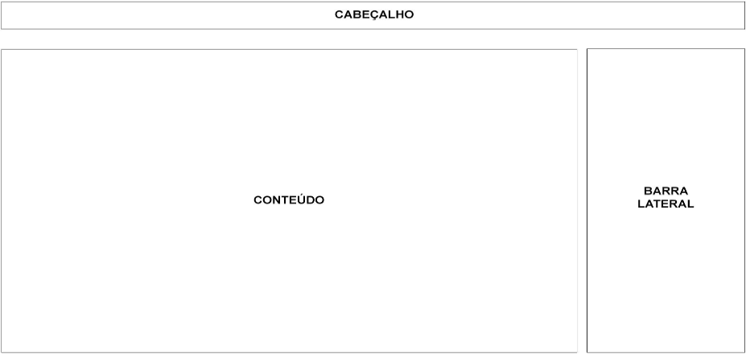
> 
### Tela - HomePage

A tela de home-page mostra a história da empresa de destaque. Com base na estrutura padrão, o bloco de conteúdo traz as peças de computadores em destaque (imagem, título, preço, ícone de compartilhamento). O bloco da Barra Lateral traz três elementos distintos: 
- Componente de pesquisa que permite substituir o conteúdo da página com o resultado da busca solicitada pelo usuário; 
- Componente de peças mais vendidas que leva o usuário para a tela de Peças mais vendidas; 
- Componente de lista de categorias que dá acesso às páginas de cada uma das seções disponibilizadas. 

> 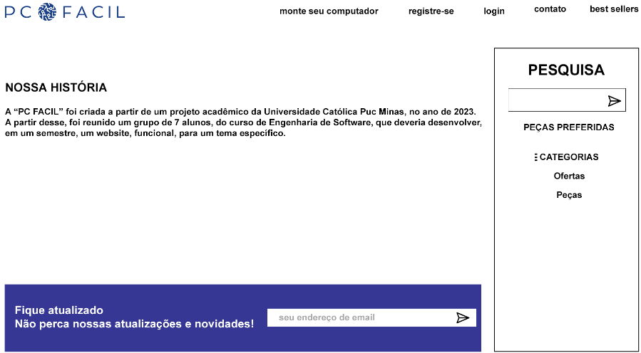

### Tela - Ofertas

A tela de ofertas de categoria apresenta, no Bloco de Conteúdo, as ofertas referentes a uma categoria específica, escolhida pelo usuário. O Bloco de Barra Lateral apresenta os mesmos elementos da Home-Page.

> 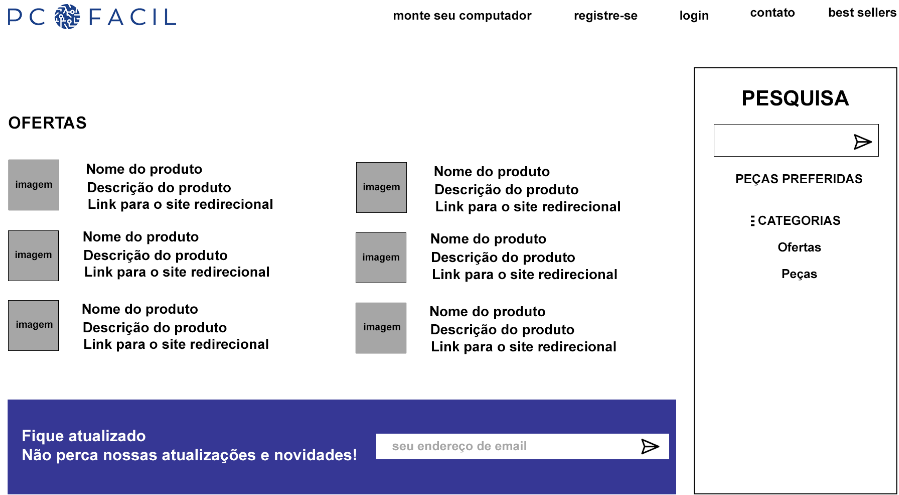

### Tela - Resultado de Pesquisa 

Assim que o usuário informa um tópico de pesquisa, ao clicar no botão Ok, ele é direcionado para uma tela que traz a relação de peças associadas ao tópico informado. Este resultado é apresentado na Figura a seguir.]

> 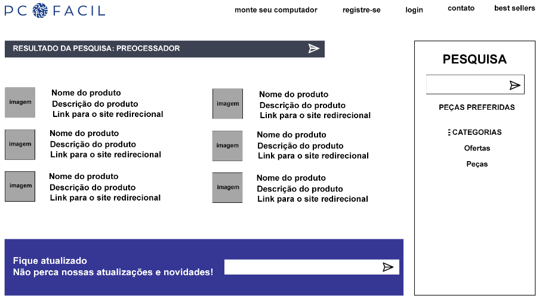

### Tela - Leitura Notícias

A tela de Descrição do produto apresenta, no Bloco de Conteúdo, uma descrição de produto melhor e mais específica. O Bloco de Barra Lateral apresenta os mesmos elementos da Home-Page.

> 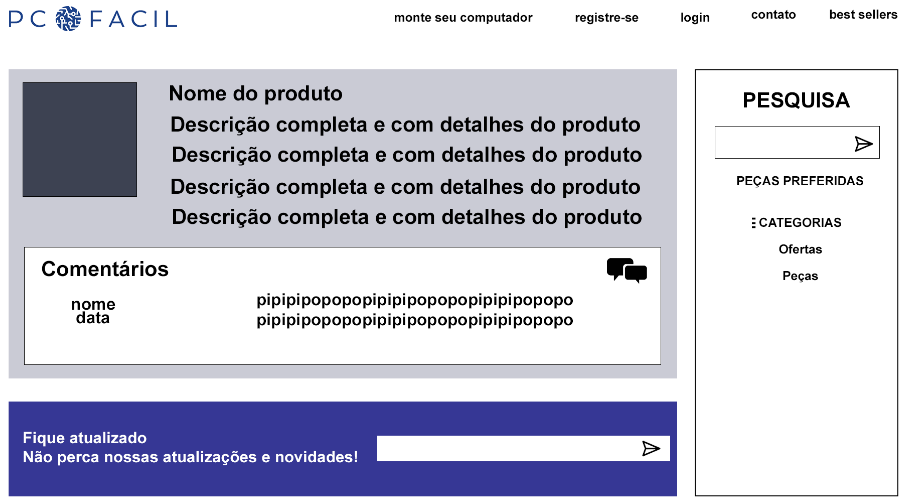

### Tela - Salvar Notícias Preferidas

A tela que permite o salvamento de peças preferidas é uma janela modal (surge sobre outras janelas) quando o usuário pressiona o texto “peças preferidas” na tela da barra lateral. Nesta tela, a peça a ser salva é visualizada e o usuário pode informar um tópico ou escolher entre os já cadastrados. Em seguida deve confirmar ou cancelar o salvamento. Na sequência, a tela é fechada voltando para o ambiente anterior. 

> 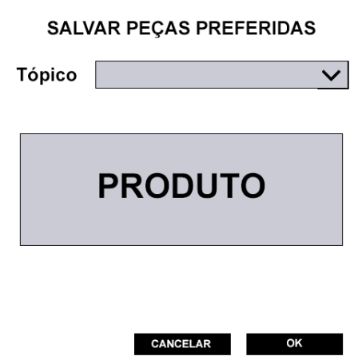

### Tela - Notícias Preferidas

A tela de Peças Preferidas apresenta a relação de peças salvas pelo usuário. Nesta tela, as peças são separadas pelo Tópico informado pelo usuário. Os tópicos servem como uma identificação de agrupamento das peças salvas. Ao clicar em uma peça é disparada a tela de visualização da peça. O Bloco de Barra Lateral apresenta os mesmos elementos da Home-Page.

> 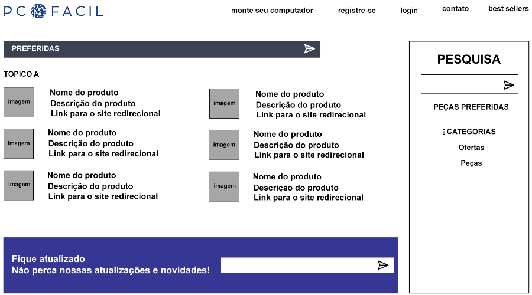

### Tela - Comentários 

Na tela que permite ao usuário comentar uma peça, deve-se informar o nome de quem está comentando e o texto do comentário. Esta tela é exibida na forma de uma janela modal. Em seguida, deve-se confirmar ou cancelar o salvamento do comentário. Na sequência, a tela é fechada voltando para o ambiente anterior.

> 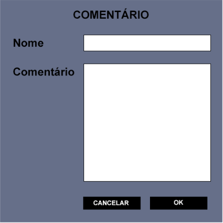

# Metodologia

A metodologia inclui as definições de ferramentas utilizadas 
pela equipe tanto para manter os códigos e outros artefatos, quanto para 
organizar o time durante a execução das tarefas do projeto. Listadas a seguir. 

### Relação de Ambientes de Trabalho

|Ambiente     | Plataforma                 |Link de Acesso |
|-------------|-------------------|---------------|
|Repositório de código fonte|GitHub|(https://github.com/ggleroy/ProjetoTIAW_PCFacil)| 
|Documentos do projeto|Google Drive|(https://sgapucminasbr-my.sharepoint.com/personal/1247101_sga_pucminas_br/_layouts/15/onedrive.aspx?view=1 )| 
|Projeto de Interface e  Wireframes|Miro|(https://miro.com/app/board/uXjVMYDaOFM=/)| 
|Gerenciamento do Projeto|Trello |(https://trello.com/b/8rem2J2Y/sprint-montagem-de-computadores)| 

## Divisão de Papéis

A equipe utiliza metodologias ágeis, tendo escolhido o Scrum como base para definição do processo de desenvolvimento.

A equipe está organizada da seguinte maneira: 

- Scrum Master: Guilherme Leroy 
- Product Owner: PUC Minas
##### Equipe de Desenvolvimento 
- Kayler de Freitas  (Desenvolvedor BackEnd) 
- Ian Matsuhara (Desenvolvedor Back End) 
- Henry Sven (Desenvolvedor Front End) 
- Yan Esquerdo (Desenvolvedor Front End) 
- Julia Resende (Designer) 
- Otávio (desenvolvedor Front End)

Para organização e distribuição das tarefas do projeto, a equipe está utilizando
Trello estruturado com as seguintes listas: 
( **Locked** )

**Recursos**: esta lista mantém um template de tarefas recorrentes com as configurações padronizadas que todos devem seguir. O objetivo é permitir a cópia destes templates para agilizar a criação de novos cartões.

**Backlog**: recebe as tarefas a serem trabalhadas e representa o Product Backlog. Todas as atividades identificadas no decorrer do projeto também devem ser incorporadas a esta lista.

**To Do**: Esta lista representa o Sprint Backlog. Este é o Sprint atual que estamos trabalhando.

**Doing**: Quando uma tarefa tiver sido iniciada, ela é movida para cá. 

**Test**: Checagem de Qualidade. Quando as tarefas são concluídas, eles são movidos para o “CQ”. No final da semana, eu revejo essa lista para garantir que tudo saiu perfeito. 

**Done**: nesta lista são colocadas as tarefas que passaram pelos testes e controle de qualidade e estão prontos para serem entregues ao usuário. Não há mais edições ou revisões necessárias, ele está agendado e pronto para a ação.

**Locked**: Quando alguma coisa impede a conclusão da tarefa, ela é movida para esta lista juntamente com um comentário sobre o que está travando a tarefa.

O quadro kanban do grupo no Trello está disponível através da URL https://trello.com/b/8rem2J2Y/sprint-montagem-de-computadores e é apresentado, no estado atual, abaixo. 

> 

## Controle de Versão

Para gestão do código fonte do software desenvolvido pela equipe, o grupo utiliza um processo baseado no Git Feature Branch Workflow, mostrado na Figura a seguir. Desta forma, todas as manutenções no código são realizadas em branches separadas. Uma explicação rápida sobre este processo é apresentada no site
# Referências

Referências Bibliográficas

>LIFEWIRE. Building vs. Buying a PC. Disponível em: https://www.lifewire.com/building-vs-buying-a-pc-832692. Acesso em: 18 abr. 2023.

>CRUCIAL. How to Build a Computer. Disponível em: https://www.crucial.com/articles/pc-builders/how-to-build-a-computer. Acesso em: 18 abr. 2023.

>WINDOWS CENTRAL. How to build a PC: The ultimate step-by-step guide. Disponível em: https://www.windowscentral.com/how-build-pc-ultimate-step-step-guide. Acesso em: 18 abr. 2023.

>TECHTUDO. Conheça os principais erros ao montar um computador e saiba como evitar. [S.l.], 2013. Disponível em: https://www.techtudo.com.br/google/amp/noticias/2013/11/conheca-os-principais-erros-ao-montar-um-computador-e-saiba-como-evitar.ghtml. Acesso em: 18 abr. 2023.

>GAMER INFO. Montar um PC em casa. Gamer Info, publicado em 15 jun. 2021. Disponível em: https://www.gamerinfo.com.br/2021/06/15/montar-um-pc-em-casa/. Acesso em: 18 abr. 2023.
